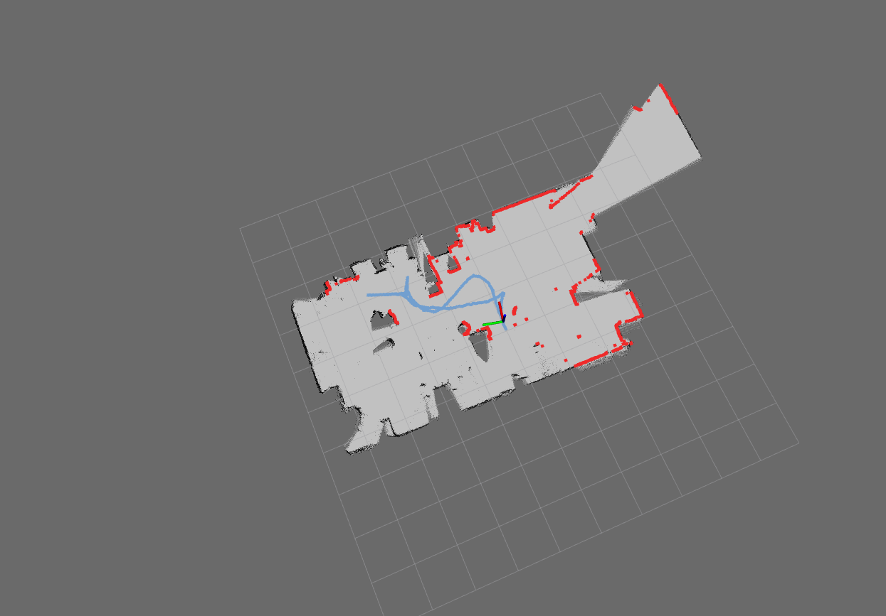

# pa_slam
LiDAR based SLAM. This SLAM was implemented by Remy Guyonneau and is based on the work of Sebastien Lagrange and Philippe Lucidarme.

Here is the output of the demo (screen captured from rviz):



This package has been tested with:
 - Ubuntu 18.04
 - ROS melodic

# package organization

The package has been created with the catkin_create_pkg command. Here is an overview of the files:

 - pa_slam
   - CMakeLists.txt : generated by catkin_create_pkg and modified to fit the ros package
   - LICENSE : generated automatically by github
   - README.md : this file
   - package.xml : basic informations about this package
   - pa_slam_node.cpp : source code of the node that uses the SLAM classes to create a map
   - images
     - demo.png : a screen capture of the demo results
   - launch
     - demo_pa_slam.launch : a launch file to start the demo
     - pa_slam.launch : a launch file example to start the node with some parameters
   - rosbag
     - demo.bag : a rosbag created for the slam demo
   - rviz
     - demo.rviz : an rviz configuration made for the demo
   - src
     - PaSLAM.cpp/.h : the PaSLAM class, this is the main class that implemented the nelder and mead algorithm to compute the best transformation for LiDAR data according to the current map
     - PaSLAM_Costmap.cpp/.h : the PaSLAM_Costmap class, this class allows to compute costs, used for the evaluation function
     - PaSLAM_Map.cpp/.h : the PaSLAM_Map class, this class allows to manipulate the probability map
   - output
     - This folder is empty, if you start the demo and you save the map as csv file, it should be saved here

# to start the demo

After building the package 
```
    catkin_make
```
You should be able to run the demo launch file:
```
    roslaunch pa_slam demo_pa_slam.launch
```
This should starts: the slam node, the rosbag and rviz
